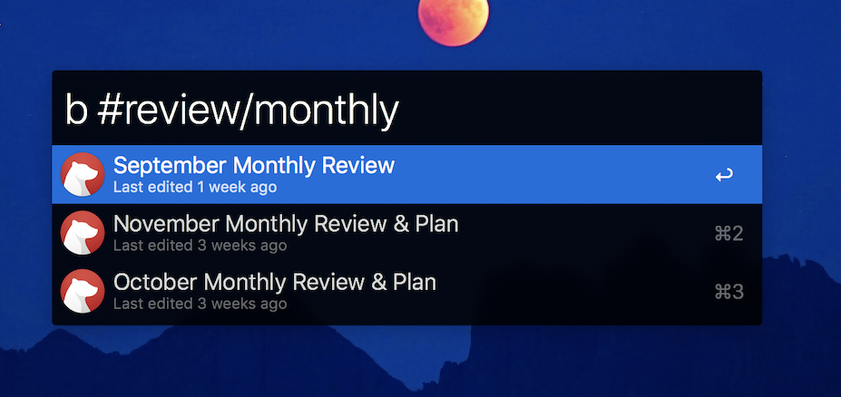

# alfred-bear

Allows you to quickly search for and open Bear notes from Alfred. It will search tags, note content, titles, etc. to try to bring you the best match.

## Installation

Download `alfred-bear-VERSION.alfredworkflow.dmg` from the [latest release](https://github.com/cdzombak/alfred-bear/releases/latest), open the downloaded `.dmg` file, and double-click the `.alfredworkflow` file to install it.

## Usage

Open Alfred and type `b` and try typing a query. You can change the search keyword or configure a hotkey for it in the workflow settings.

## About

Maintained by [Chris Dzombak](https://www.dzombak.com) ([@cdzombak on GitHub](https://github.com/cdzombak)).

Originally based on [bjrnt/alfred-bear](https://github.com/bjrnt/alfred-bear).

Principal changes in @cdzombak's fork:
- Use [modernc.org/sqlite](https://pkg.go.dev/modernc.org/sqlite) to remove cgo dependency
- Update dependencies
- Use GitHub Actions for the build & release process
- Build the embedded `alfred-bear` binary for both Intel and Apple Silicon processors
- Codesign the embedded `alfred-bear` binary for distribution outside the Mac App Store
- Notarize the workflow in a DMG for distribution

## License

MIT; see LICENSE in this repository.
